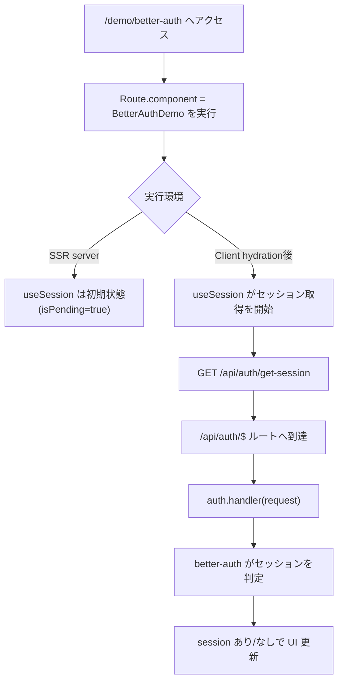
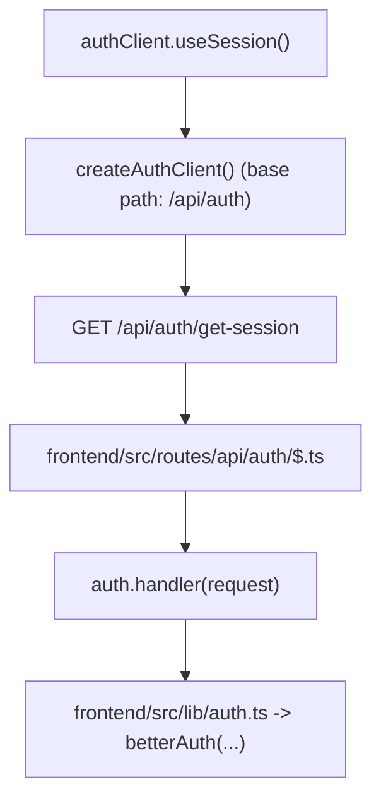

# 設計メモ

最終更新日: 2026-03-01

## 1. 目的

- 実装時に迷いやすい設計上の判断ポイントを、恒久的に参照できる形で残す。
- 本ドキュメントは、要件（`01_product_requirements.md`）とアーキテクチャ（`02_architecture.md`）を補完する。

## 2. Backend

（未記載）

## 3. Frontend

### 3.1 `createFileRoute(... )({ component })` の扱い

- `component` は「そのルートで描画する React コンポーネント」を指定する。
- このプロジェクトは SSR 有効であるため、初回 HTTP リクエスト時は対象ルートのコンポーネントがサーバで実行される。
- ただし、最終的に画面状態が確定するタイミングは、コンポーネント内で使っているデータ取得方式に依存する（例: `useSession`）。

### 3.2 Better Auth `useSession` の実行フロー（`/demo/better-auth`）

- 対象ルート: `frontend/src/routes/demo/better-auth.tsx`
- ルート定義: `createFileRoute('/demo/better-auth')({ component: BetterAuthDemo })`
- この画面では `authClient.useSession()` を利用している。
- `useSession` の内部実装はサーバ環境ではセッション取得フェッチを実行せず、クライアント hydration 後に取得を開始する。
- そのため、初回 SSR HTML では `isPending: true` の初期分岐（ローディング表示）になりうる。

### 3.3 `/get-session` がどこで提供されるか

- `createAuthClient()` のデフォルト base path は `/api/auth`。
- `useSession` は内部で `"/get-session"` を参照するため、実際の到達先は `/api/auth/get-session`。
- このプロジェクトでは `frontend/src/routes/api/auth/$.ts` で `auth.handler` に委譲しており、Better Auth
  側のハンドラがエンドポイントを提供する。

### 3.4 実装上の注意

- SSR 初期表示時点でセッション表示を確定させたい場合、`useSession` のみではなくサーバ側ミドルウェアやサーバ処理でのセッション解決を併用する。
- 現状はヘッダー側でも `useSession` を呼んでいるため、クライアント遷移時はセッション状態が既に解決済みであるケースが多い。

## 4. 参考 URL

- TanStack Start: Selective SSR  
  https://tanstack.dev/start/latest/docs/framework/react/guide/selective-ssr
- TanStack Start（概要）  
  https://tanstack.dev/start
- Better Auth: TanStack Start Integration  
  https://www.better-auth.com/docs/integrations/tanstack
- Better Auth: Session Management（`getSession` / `useSession`）  
  https://www.better-auth.com/docs/concepts/session-management
- Better Auth: Installation（client の base path に関する説明）  
  https://www.better-auth.com/docs/installation
