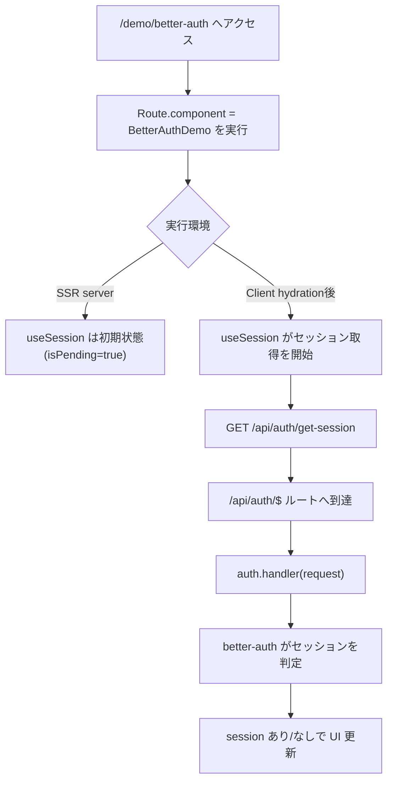
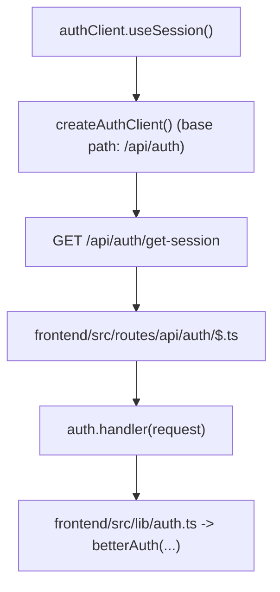
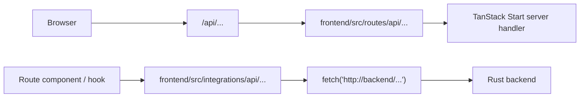
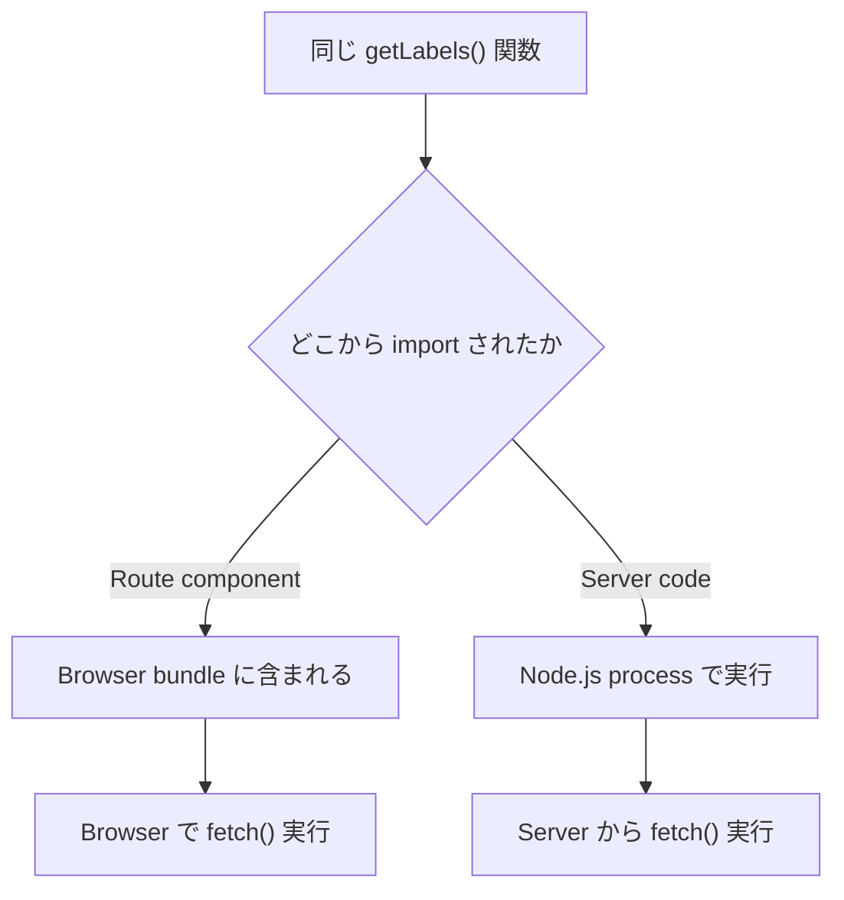

# 設計メモ

最終更新日: 2026-03-07

## 1. 目的

- 実装時に迷いやすい設計上の判断ポイントを、恒久的に参照できる形で残す。
- 本ドキュメントは、要件（`01_product_requirements.md`）とアーキテクチャ（`02_architecture.md`）を補完する。

## 2. Backend

（未記載）

## 3. Frontend

### 3.1 `createFileRoute(... )({ component })` の扱い

- `component` は「そのルートで描画する React コンポーネント」を指定する。
- このプロジェクトは SSR 有効であるため、初回 HTTP リクエスト時は対象ルートのコンポーネントがサーバで実行される。
- ただし、最終的に画面状態が確定するタイミングは、コンポーネント内で使っているデータ取得方式に依存する（例: `useSession`）。

### 3.2 Better Auth `useSession` の実行フロー（`/demo/better-auth`）

- 対象ルート: `frontend/src/routes/demo/better-auth.tsx`
- ルート定義: `createFileRoute('/demo/better-auth')({ component: BetterAuthDemo })`
- この画面では `authClient.useSession()` を利用している。
- `useSession` の内部実装はサーバ環境ではセッション取得フェッチを実行せず、クライアント hydration 後に取得を開始する。
- そのため、初回 SSR HTML では `isPending: true` の初期分岐（ローディング表示）になりうる。

```mermaid
flowchart TB
    A["/demo/better-auth へアクセス"] --> B["Route.component = BetterAuthDemo を実行"]
    B --> C{"実行環境"}
    C -->|SSR server| D["useSession は初期状態\n(isPending=true)"]
    C -->|Client hydration後| E["useSession がセッション取得を開始"]
    E --> F["GET /api/auth/get-session"]
    F --> G["/api/auth/$ ルートへ到達"]
    G --> H["auth.handler(request)"]
    H --> I["better-auth がセッションを判定"]
    I --> J["session あり/なしで UI 更新"]
```

### 3.3 `/get-session` がどこで提供されるか

- `createAuthClient()` のデフォルト base path は `/api/auth`。
- `useSession` は内部で `"/get-session"` を参照するため、実際の到達先は `/api/auth/get-session`。
- このプロジェクトでは `frontend/src/routes/api/auth/$.ts` で `auth.handler` に委譲しており、Better Auth
  側のハンドラがエンドポイントを提供する。

```mermaid
flowchart TD
    U["authClient.useSession()"] --> V["createAuthClient() (base path: /api/auth)"]
    V --> W["GET /api/auth/get-session"]
    W --> X["frontend/src/routes/api/auth/$.ts"]
    X --> Y["auth.handler(request)"]
    Y --> Z["frontend/src/lib/auth.ts -> betterAuth(...)"]
```

### 3.4 実装上の注意

- SSR 初期表示時点でセッション表示を確定させたい場合、`useSession` のみではなくサーバ側ミドルウェアやサーバ処理でのセッション解決を併用する。
- 現状はヘッダー側でも `useSession` を呼んでいるため、クライアント遷移時はセッション状態が既に解決済みであるケースが多い。

### 3.5 `routes/api` と `integrations/api` の役割分担

- `frontend/src/routes/api/` は TanStack Start が外部に公開する HTTP エンドポイントを置く場所である。
- `frontend/src/integrations/` は認証や外部 API 連携など、アプリ内部から利用する基盤コードを置く場所である。
- そのため、`routes/api` は「外向きの入口」、`integrations/api` は「内部から使う API クライアント」という役割で分ける。
- Better Auth のように frontend 側で HTTP ルートを提供するものは `routes/api/auth/` に置く。
- Rust backend を呼び出すための `getLabels()` や `postHistory()` のような関数は `integrations/api/` に置く。

```mermaid
flowchart LR
    A["Browser"] --> B["/api/..."]
    B --> C["frontend/src/routes/api/..."]
    C --> D["TanStack Start server handler"]

    E["Route component / hook"] --> F["frontend/src/integrations/api/..."]
    F --> G["fetch('http://backend/...')"]
    G --> H["Rust backend"]
```

### 3.6 `integrations/api` は server 専用ではない

- `integrations/api` のモジュールは、server 専用の特殊機構ではなく通常の TypeScript モジュールである。
- そのため、どこから import されたかによって実行環境が決まる。
- クライアント画面から import されればブラウザ用バンドルに含まれ、ブラウザ上で実行される。
- サーバ処理から import されれば、TanStack Start のサーバプロセス上で実行される。
- したがって `integrations/api` には、秘密鍵や server 専用環境変数のような「ブラウザへ出してはいけない処理」は置かない。

```mermaid
flowchart TB
    A["同じ getLabels() 関数"] --> B{"どこから import されたか"}
    B -->|Route component| C["Browser bundle に含まれる"]
    C --> D["Browser で fetch() 実行"]
    B -->|Server code| E["Node.js process で実行"]
    E --> F["Server から fetch() 実行"]
```

### 3.7 現時点の Rust API client 方針

- Rust backend 向けの HTTP 呼び出しは、route component 内へ `fetch(...)` を直書きせず `integrations/api` に集約する。
- まずは以下のような薄い構成から始める。
    - `frontend/src/integrations/api/client.ts`
        - `fetchJson` などの共通 HTTP ラッパ
        - base URL、共通 header、共通エラー処理
    - `frontend/src/integrations/api/generation.ts`
        - `getLabels`, `getUnits`, `postHistory` など API 単位の関数
    - 必要に応じて `frontend/src/integrations/api/types.ts`
        - backend DTO の型
- route 側は `useQuery({ queryKey, queryFn })` に専念し、`queryFn` として `integrations/api` の関数を渡す。
- BFF 的な中継や認可制御が必要になった場合のみ、`routes/api` にサーバルートを追加して backend との間に挟む。

## 4. 参考 URL

- TanStack Start: Selective SSR  
  https://tanstack.dev/start/latest/docs/framework/react/guide/selective-ssr
- TanStack Start（概要）  
  https://tanstack.dev/start
- Better Auth: TanStack Start Integration  
  https://www.better-auth.com/docs/integrations/tanstack
- Better Auth: Session Management（`getSession` / `useSession`）  
  https://www.better-auth.com/docs/concepts/session-management
- Better Auth: Installation（client の base path に関する説明）  
  https://www.better-auth.com/docs/installation
